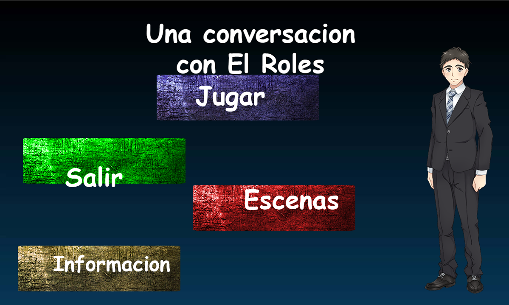
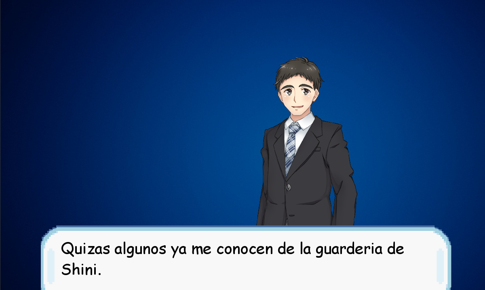
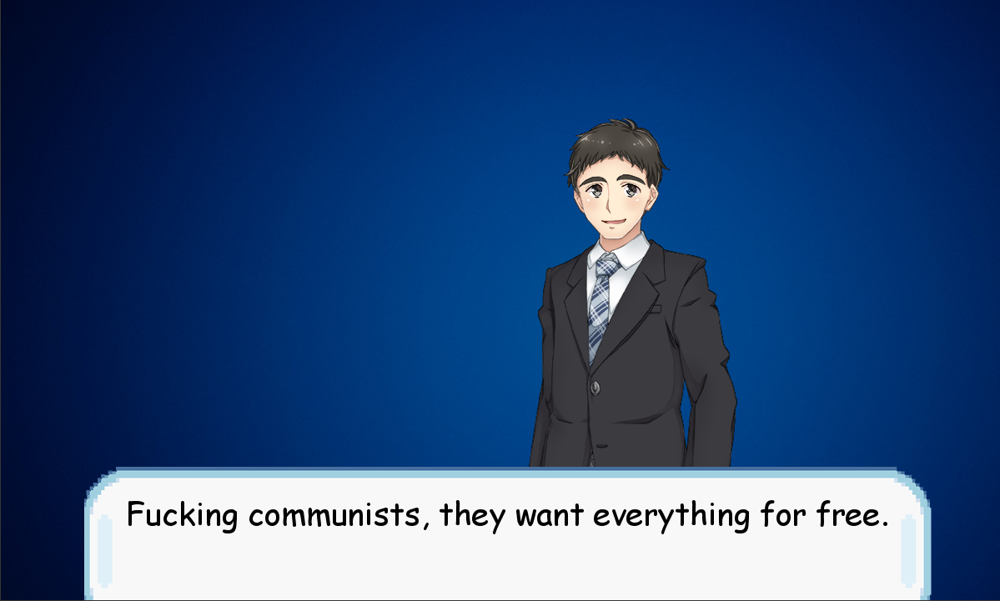

# Una-Conversacion-Con-El-Roles
 Aventura conversacional para nada family friendly

<h1>Leer antes de llorar</h1>

<h4>Conceptos y aclaraciones:</h4>

Los botones estan mal ubicados a conciencia, recuerden que la idea es que no llegues al final del juego sino que lo cierres antes por eso tambien la decision de usar comic sans en todo el juego.

Recomiendo que los niveles especial los jueguen en la resolucion nativa.
Aun no encontre como solucionar este bug. Posiblemente lo mueva a un motor.

Contiene lenguaje ofensivo, comentarios xenofobos, homofobos y pensamientos hostiles.

stoppen sie die hand versuchen zu arbeiten enrealidad es:
Paren la mano, prueben laburando pero como en aleman parece una referencia a la
masturbacion se quedo XD.

<h1>Capturas</h1>

